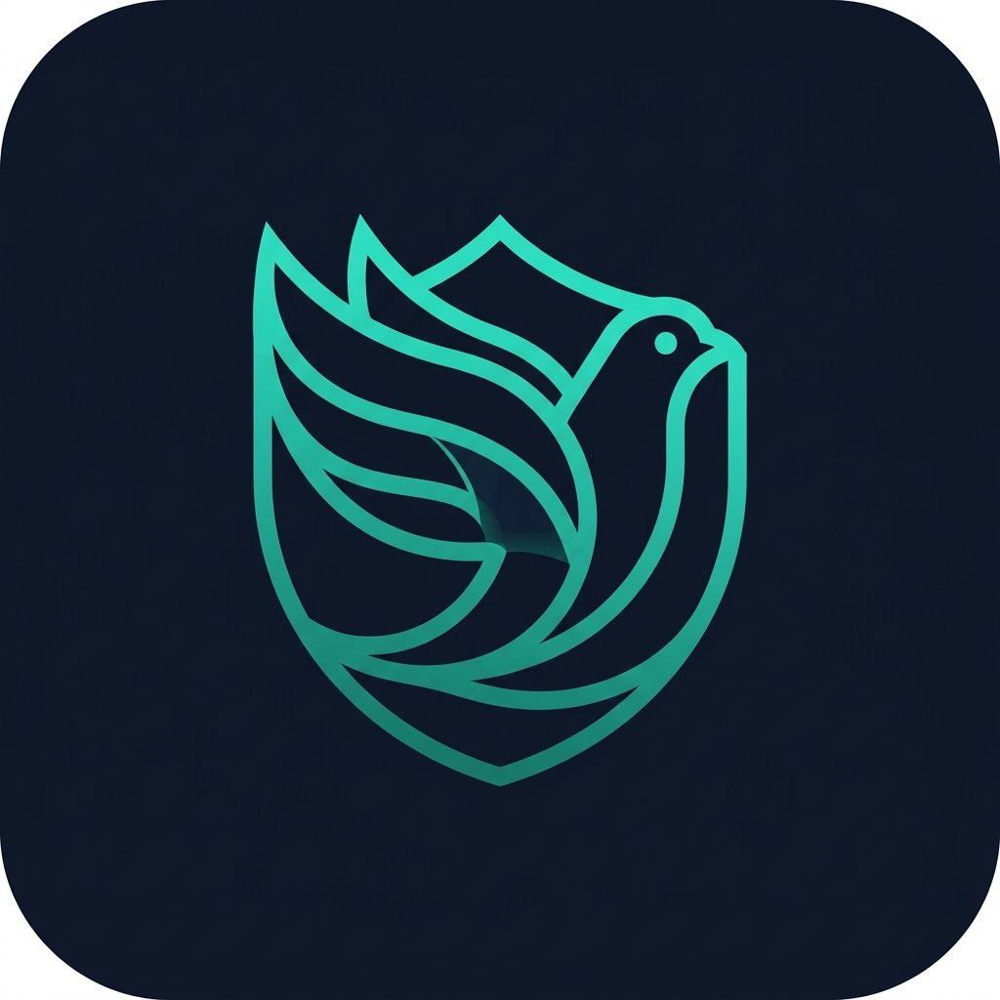
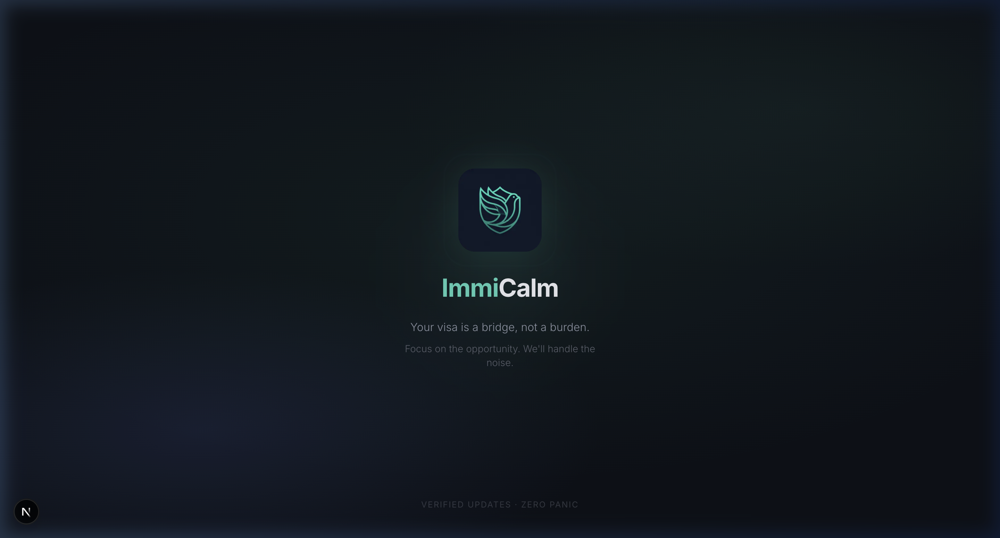
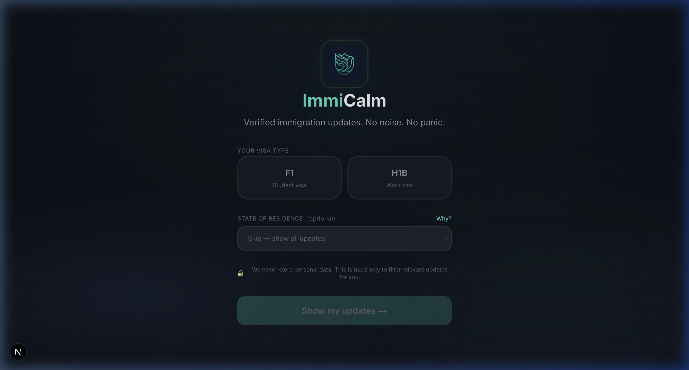
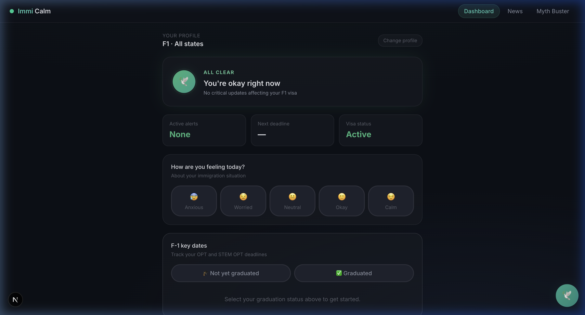
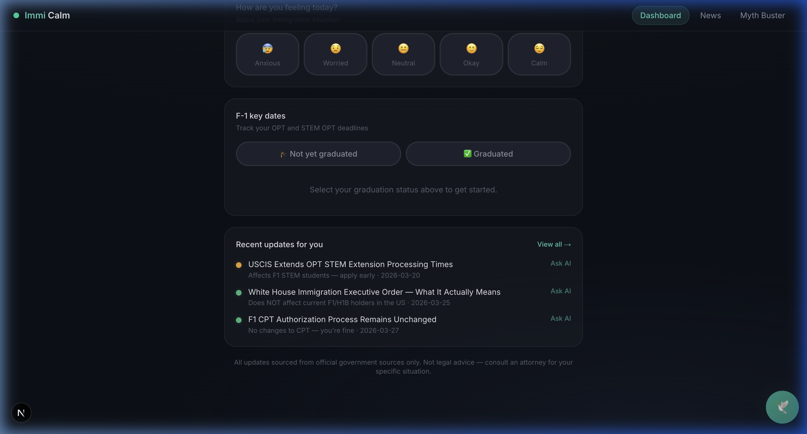
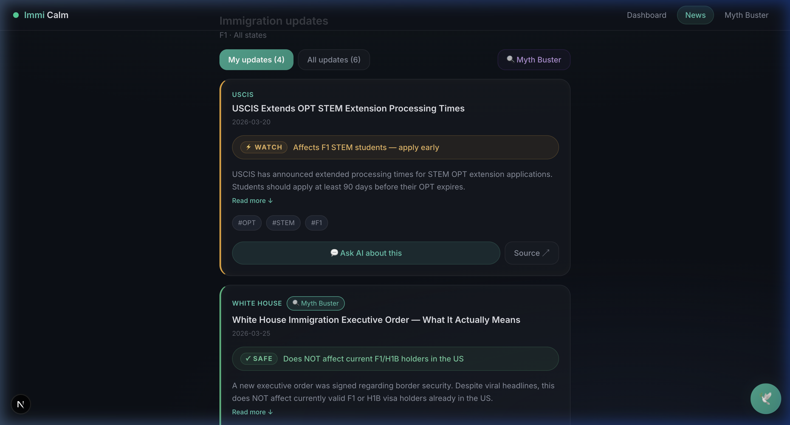
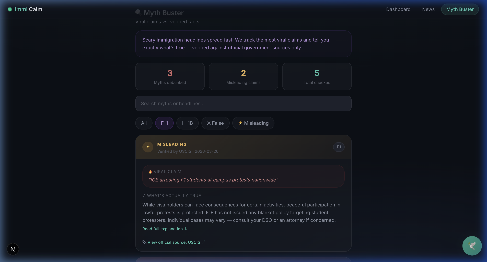

<p align="center">
  
</p>

<h1 align="center">ImmiCalm</h1>

<p align="center">
  <strong>Your visa is a bridge, not a burden.</strong><br/>
  Focus on the opportunity. We'll handle the noise.
</p>

<p align="center">
  <em>US-Nepal Hackathon 2026 · Theme: Mental Health · Track: Career Pressure & Uncertainty</em>
</p>

---

## 🧠 Problem Statement

Nepali immigrants in the United States — particularly those on **F-1 student visas** and **H-1B work visas** — face chronic anxiety and uncertainty from constantly shifting immigration policies. This mental burden is heavily amplified by:

- **Clickbait headlines** that exaggerate or misrepresent policy changes
- **Misinformation** spreading virally on social media and WhatsApp groups
- **No single trusted source** that filters news by visa type and severity
- **Isolation** — not knowing who else is going through the same stress

The result: talented individuals who should be focused on their studies, careers, and contributions to society are instead consumed by fear about their future in the US.

## 💡 Solution

**ImmiCalm** is a privacy-first web application that acts as an **anxiety-reducing filter** between immigration news and the user. Instead of doomscrolling through panic-inducing headlines, users see:

1. **Only what affects them** — news filtered by their visa type (F-1 or H-1B) and state
2. **Severity-rated updates** — green (safe), yellow (watch), red (action needed) — so they know what actually matters
3. **Myth-busted viral claims** — side-by-side comparison of viral headlines vs. verified facts
4. **AI-powered Q&A** — ask questions about any news update or general visa topics and get contextual answers
5. **Mood-aware responses** — the app adjusts its tone and shows community resources when the user reports high anxiety
6. **F-1 timeline tracking** — OPT/STEM OPT deadlines, grace periods, and H-1B planning milestones

**Zero personal data is stored server-side.** All profile data lives in the browser's React state only.

---

## 📸 Screenshots

<details>
<summary><strong>🚀 Splash Screen</strong> — App launch with animated logo and motto</summary>
<br/>



The app opens with a cinematic splash experience: the dove-shield logo scales in with a breathing glow ring, followed by the name "ImmiCalm" and the motto *"Your visa is a bridge, not a burden."*

</details>

<details>
<summary><strong>📋 Onboarding</strong> — Select your visa type and state</summary>
<br/>



Dark sanctuary-themed onboarding with glassmorphism selection cards. Users pick their visa type (F-1 or H-1B) and optionally their US state to receive personalized, filtered updates.

</details>

<details>
<summary><strong>🏠 Dashboard</strong> — Your personalized command center</summary>
<br/>



The dashboard features:
- **Breathing status orb** that color-shifts by alert level (green → amber → red)
- **Stat cards** showing active alerts, next deadline, and visa status
- **Mood check-in** with emoji selection and adaptive messaging
- **F-1 key dates** with interactive timeline tracker



Scrolling down reveals the F-1 timeline tracker with color-coded countdown badges, and a summary of recent immigration updates with "Ask AI" shortcuts.

</details>

<details>
<summary><strong>📰 News Feed</strong> — Filtered, severity-rated updates</summary>
<br/>



Glass card news feed with:
- Left-border severity indicators (green/amber/red)
- "SAFE", "WATCH", "ACTION" status badges
- Source attribution and "Ask AI about this" for each card
- Filter between "My updates" (visa-specific) and "All updates"

</details>

<details>
<summary><strong>🔍 Myth Buster</strong> — Viral claims vs. verified facts</summary>
<br/>



Tracks scary viral immigration claims and debunks them with official sources:
- Stat cards showing myths debunked, misleading claims, and total checked
- Each myth card shows the viral headline, verdict, and what's actually true
- Links to official government source materials

</details>

---

## 🏗️ Architecture

```
src/
├── app/                          # Next.js App Router pages
│   ├── page.tsx                  # Root → Splash screen → redirect
│   ├── layout.tsx                # Global layout (Inter font, dark mode)
│   ├── globals.css               # Complete design system (250+ lines)
│   ├── onboarding/page.tsx       # Visa type & state selection
│   ├── dashboard/page.tsx        # Personalized command center
│   ├── news/page.tsx             # Filtered news feed
│   ├── mythbuster/page.tsx       # Myth buster with fact-checks
│   ├── chatbot/page.tsx          # AI Q&A (general + article-specific)
│   └── api/
│       ├── chat/route.ts         # Proxy to chatbot backend
│       └── chat/stream/route.ts  # Streaming chat variant
├── components/
│   ├── SplashScreen.tsx          # Animated app launch screen
│   ├── Nav.tsx                   # Glassmorphism nav bar
│   ├── NavWrapper.tsx            # Conditional nav visibility
│   ├── AskAIButton.tsx           # Floating AI action button
│   ├── MoodCheckin.tsx           # Mood selection widget
│   ├── chatbot/
│   │   └── MessageBubble.tsx     # Chat message component
│   └── news/
│       ├── NewsCard.tsx          # News article card
│       ├── MythCard.tsx          # Myth buster card
│       └── AffectBadge.tsx       # Severity badge
├── data/
│   ├── news.json                 # Curated immigration news items
│   └── myths.json                # Viral claims + fact-checks
├── lib/
│   └── userContext.tsx            # React Context for user profile
└── public/
    └── logo.png                  # Generated dove-shield logo
```

### Data Flow

```
User Profile (React Context)
    │
    ├── visaType: "F1" | "H1B"
    ├── state: "California" | null
    ├── mood: 1-5
    ├── gradDate: ISO date
    └── optEndDate: ISO date
         │
         ▼
    ┌─────────────┐
    │  news.json   │ ──→ Filter by visaType + state ──→ Dashboard / News Feed
    │  myths.json  │ ──→ Filter by visaType ──→ Myth Buster
    └─────────────┘
         │
         ▼
    ┌─────────────────┐
    │  /api/chat       │ ──→ Proxy to Python chatbot backend
    │  (Next.js route) │     with article context injection
    └─────────────────┘
```

### Severity System

| Level | Color | Meaning | User Action |
|-------|-------|---------|-------------|
| 🟢 **Green** | `hsl(152, 50%, 48%)` | Safe — no action needed | None |
| 🟡 **Yellow** | `hsl(38, 80%, 55%)` | Watch — worth reviewing | Read & monitor |
| 🔴 **Red** | `hsl(0, 60%, 55%)` | Action needed — may affect your status | Review immediately |

---

## 🎨 Design System

The UI follows a **"calm-first" design philosophy** — every visual decision is intentional to reduce anxiety:

| Element | Choice | Rationale |
|---------|--------|-----------|
| **Base color** | Dark navy `hsl(222, 28%, 7%)` | Dark, warm tones reduce cortisol — especially for late-night browsing when anxiety peaks |
| **Primary accent** | Teal `hsl(168, 55%, 42%)` | Sits between blue (trust) and green (safety) — the anxiety-reduction sweet spot |
| **Glass effects** | `backdrop-blur(20px)` | Creates depth and premium feel without visual noise |
| **Animations** | `cubic-bezier(0.16, 1, 0.3, 1)` | Premium ease-out curves — never jarring or sudden |
| **Typography** | Inter (Google Fonts) | Clean, modern, highly readable at all sizes |
| **Logo** | Dove inside shield | Peace + Protection — the core promise of the app |

### Key Animations

| Animation | Usage | Duration |
|-----------|-------|----------|
| `breathe` | Dashboard status orb | 4s infinite |
| `breathe-ring` | Orb outer ring pulse | 4s infinite |
| `pulse-dot` | Status indicators | 2s infinite |
| `float-in` | Page section entrance | 0.5s staggered |
| `slide-up` | Card entrance | 0.5s staggered |
| `scale-in` | AI popup panel | 0.35s |
| `wave-dot` | Chatbot loading dots | 1.2s |

---

## 🚀 Getting Started

### Prerequisites

- **Node.js** 18+ and npm
- (Optional) Python chatbot backend for AI Q&A features

### Installation

```bash
# Clone the repository
git clone https://github.com/your-org/nepal-us_hackathon-team67.git
cd nepal-us_hackathon-team67

# Install dependencies
npm install
```

### Environment Setup

Create a `.env.local` file for the chatbot API backend:

```env
CHATBOT_API_BASE=http://127.0.0.1:8000
```

> If the chatbot backend isn't running, all other features (news feed, dashboard, myth buster, mood check-in, F-1 timeline) work independently. The AI chat will show a friendly error message.

### Run Development Server

```bash
npm run dev
```

Open [http://localhost:3000](http://localhost:3000) to see the splash screen → onboarding → dashboard.

### Production Build

```bash
npm run build
npm start
```

---

## 🤖 AI Chatbot Integration

The chatbot operates in two modes:

### General Q&A Mode
When no news article is selected, the chatbot answers general visa questions:
- *"What should I know about maintaining F1 status?"*
- *"Can I change employers on H1B?"*
- *"How does OPT work and when should I apply?"*

### Article-Specific Mode
When triggered from a news card ("Ask AI about this"), the chatbot:
1. Injects the full article context (title, summary, severity, affected visas)
2. Forces article-first answering with conversation history
3. Maintains user profile context (visa type, state)

The Next.js API route at `/api/chat` acts as a proxy to the Python backend, building a structured prompt with:
- Conversation mode flag (GENERAL_QA or ARTICLE_SPECIFIC)
- User profile (visa type + state)
- Article metadata + full text (if available, truncated to 16K chars)
- Last 6 messages of conversation history

---

## 🔒 Privacy

ImmiCalm is **privacy-first by design**:

- ❌ No database — no backend storage of any personal information
- ❌ No cookies — no tracking across sessions
- ❌ No analytics — no third-party scripts
- ✅ All profile data lives in **React state** (browser memory only)
- ✅ Data resets completely on page refresh
- ✅ News data is static JSON — no API calls to external news services

This was a conscious architectural decision: immigrants dealing with visa anxiety should never have to worry about *"what happens to my data?"*

---

## 🛠️ Tech Stack

| Layer | Technology |
|-------|-----------|
| **Framework** | Next.js 16 (App Router) |
| **Language** | TypeScript |
| **Styling** | Tailwind CSS 4 + custom CSS design system |
| **Font** | Inter (via `next/font/google`) |
| **State** | React Context API |
| **AI Chat** | Next.js API route → Python backend proxy |
| **Data** | Static JSON (news + myths) |
| **Deployment** | Vercel-ready |

---

## 👥 Team

**Team 67** — US-Nepal Hackathon 2026

---

## 📄 License

This project was built for the US-Nepal Hackathon 2026. All rights reserved.
